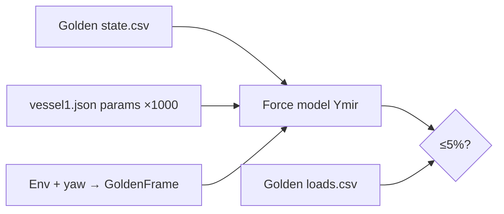

# Design — Alinhamento dos Modelos de Força ao Golden

> **Spec**: [spec.md](./spec.md) · **Status**: Draft
> **Pesquisa**: fórmulas do engine de referência extraídas de
> `dynamics/nashville/src/*Forces/` (fastTime C++ que gerou o golden), cruzadas
> com o Ymir em `core/libs/physics/src/forces/`.

## Como abordar (HOW)

O alinhamento é **numérico, não estrutural**. Para cada modelo:
1. Comparar a fórmula do Ymir com a do engine de referência (feito — abaixo).
2. Corrigir a divergência mínima (constante, sinal, área, unidade) — sem reescrever
   arquitetura, sem portar código 1:1.
3. Verificar contra o golden via `ymir_golden_tests` (método state-in→force-out).

Cada correção cita a linha da referência no commit/ADR.

## Achado que corrige a spec ⚠️

A hipótese da spec (FMA-04) de que **restauração** divergia por falta de
acoplamento hidrostático off-diagonal está **errada**: o engine de referência
também é **diagonal** (`RestoringForces.cpp:35-40`, off-diagonal comentado). A
fórmula do Ymir é idêntica. Logo o resíduo medido (6,5% `Fr_z` / 13,5% `Mr_y`)
**não é** de modelo — é artefato de cruzamento por zero (a força decai a ~0 no
assentamento, inflando o erro relativo). **FMA-04 reclassificado**: não há
mudança de código; ajustar piso absoluto do teste e documentar. Ver componente
Restauração abaixo.

---

## Architecture Overview

Nenhuma mudança arquitetural. Alterações confinadas a:
- `core/libs/physics/src/forces/*.cpp` (fórmulas)
- `core/libs/common/include/ymir/common/PhysicalConstants.h` (constantes)
- `core/libs/simulation/src/{NavalDomain,NavalSimulation}.cpp` (vento aparente)
- `core/tests/golden/` (novos testes + tolerâncias)

---

## Code Reuse Analysis

| Componente | Local | Uso |
|-----------|-------|-----|
| Harness golden | `core/tests/golden/GoldenCsv.h`, `Vessel1Params.h`, `GoldenFrame.h` | Estender p/ cenários 01,03,05,06,07 |
| `nautToBodyFrame` | `NavalDomain.cpp:15` / `GoldenFrame.h` | Reconstruir fluxo no corpo (já existe) |
| Interpolação Cd | `ymir::math::linear` | Reusar nas tabelas de coeficiente |
| Constantes | `PhysicalConstants.h` (`rho_water`, `g`, `rho_air`) | Ajustar `rho_air` |

---

## Componentes (fórmula ref → mudança no Ymir)

### FMA-01 · Corrente (OBOKATA) — 2 bugs

- **Local**: `core/libs/physics/src/forces/CurrentForces.cpp:31-101`
- **Ref**: `dynamics/nashville/src/currentForces/CurrentForces.cpp:142-195`

**Bug A — sinal (inversão de 180°)**
- Ref: `angle = atan2(vc_y, vc_x)` com `vc = speedToWater` (sem negar).
- Ymir (`:57-58`): `water_x = -vc_x; water_y = -vc_y - r·xi` → gira 180° → `Fc_x`
  com sinal trocado.
- **Fix**: usar `vc_x`, `vc_y` diretos (remover a negação); manter o termo de yaw
  `-r·xi` em `vc_y` (a ref usa `vc_sec[1] = speedToWater[1] - r·sectionPos[i]`).

**Bug B — área seccional errada (~2× baixa)**
- Ref: `hydro_scale = 0.5·rho_water·dL·sub_depth`, com
  `sub_depth = wavesOriginPosition[2] - q[2]` (calado submerso ≈ 23 m) e
  `dL = length_BP / n_sections`. Mesma área p/ Fx e Fy.
- Ymir (`:71-72`): `ds_x = frontalHeight·dx` (11,5 m), `ds_y = lateralHeight·dx`;
  `dx = length_BP/(n_sections-1)`.
- **Fix**: área seccional = `sub_depth·dL` (não `frontalHeight/lateralHeight`);
  `dL = length_BP/n_sections`. `sub_depth` vem do estado (`orig[2] - z`).

**Mz (menor)**: ref soma termo `cd_z` + correção de midship
(`CurrentForces.cpp:190-192`); Ymir só faz `Mz -= Fy·xo`. Ajustar se `Mc_z` não
fechar ≤5% após A+B.

**Roll/pitch arms**: idênticos — sem mudança.

**Config novo em `Vessel1Params.h`**: `n_sections`, `sectionLocalPositions`
(ou default −L/2..L/2), `midshipDistance`, `wavesOriginPosition` (z p/ sub_depth).
Corrente lê `current.coefficients` (col0 ângulo, col1 cdx, col2 cdy).

**Efeito esperado**: `Fc_x` −83 kN → ~+166 kN (golden +172 kN).

---

### FMA-02 · Squat — divisão dupla por (ρ·g)

- **Local**: `core/libs/physics/src/forces/SquatForces.cpp:13,49`
- **Ref**: `dynamics/nashville/src/squatForces/SquatForces.cpp:48-49`

Fórmula é **idêntica** exceto o numerador do sinkage:
- Ref: `s = -(Cs+Cf)·(volumetricWeight / (ρ·g·L²))·fn²/√(1-fn²)`
  (`volumetricWeight` = peso em N, `×1000` na carga — `Vessel.cpp:112`).
- Ymir: `nabla_ = volumetricWeight/(ρ·g)` (`:13`), depois
  `s = ...(nabla_/(ρ·g·L²))...` (`:49`) → divide por `(ρ·g)` **duas vezes**
  → fator `1/(ρ·g)=1/10055` a menos ≈ **~4 ordens de grandeza**.
- **Fix**: numerador = `volumetricWeight/(ρ·g·L²)` (divisão única). Equivale a
  trocar o denominador do termo `s` de `(ρ·g·L²)` para `L²` (pois `nabla_` já
  contém `1/(ρ·g)`), ou usar `cfg.volumetricWeight` direto.
- **Profundidade/clamp**: `depth = max(|waterDepth+tide|, |z|)` e o clamp
  `s = max(-depth-0.1-z, s)` já batem com a ref — validar na implementação (o
  número absoluto do golden depende da convenção de `q[2]`).

**Efeito esperado**: `Fsq_z` −2,1e4 → ordem de −1e8..−7e8 (validar contra golden).

---

### FMA-03 · Vento + constantes globais

- **Local**: `PhysicalConstants.h:8`; wind formula já correta
  (`WindForces.cpp`).
- **Ref**: `PhysicalProps.cpp:6-8`.

- **Fix 1**: `rho_air` 1,225 → **1,275** (casa o resíduo de 4,08%). `rho_water`
  (1025) e `g` (9,81) já iguais.
- **Fix 2 (correção, simulação)**: vento aparente. Ref subtrai velocidade do
  vessel (`speedToWind = wind - vessel_vel` no corpo); Ymir usa vento puro
  (`NavalDomain.cpp:194-196`, `speedToWind[0]=wu`). Adicionar
  `speedToWind[i] -= bs.u()/v()`. Impacto pequeno em baixa velocidade, mas
  necessário p/ correção geral. Revalidar todos os testes golden após mudar
  `rho_air` (constante compartilhada).

**Efeito esperado**: `Fwd_x` de ~4% → ≤2%.

---

### FMA-04 · Restauração — SEM mudança de código (reclassificado)

- **Local**: `RestoringForces.cpp` (Ymir) — já correto.
- **Ref**: `RestoringForces.cpp:18-56` — diagonal, fórmula idêntica.

Não adicionar off-diagonal (a ref não usa). O resíduo é cruzamento por zero no
assentamento. **Ação**: no `TestGolden08Restoring.cpp`, manter tolerância
relativa mas com piso absoluto adequado; documentar que ≤5% vale fora dos
cruzamentos. Remedir `Fr_z`/`Mr_y` com piso p/ confirmar.

---

### FMA-05 · Amortecimento — sinal e norma

- **Local**: `DampingForces.cpp:20-45`
- **Ref**: `DampingForces.cpp:32-50`

Duas divergências pequenas:
1. **Sinal surge/sway**: ref `aux_velocity[0] = -speedToWater[0]`; Ymir
   `aux[0] = +ctx.speedToWater[0]`. Alinhar sinal.
2. **`vNorm2`**: ref soma **os 6** componentes²; Ymir só surge²+sway². Alinhar
   (usar os 6) — afeta o `decayFactor`.

Heave (`Fd_z`) já bate (0,05–0,6% com movimento). Após 1+2, apertar piso p/ ≤5%
em baixa velocidade.

---

### FMA-06 · Leme

- **Local**: `RudderForces.cpp` (Ymir) — **comparar** (ainda não lido em detalhe).
- **Ref**: `RudderForces.cpp:34-69`.

Fórmula ref: `fd=0.5·ρ·A·v²·cd`, `fl=...·cl`; `α=atan2(v_rel,u_rel)`;
`β=wrap360(-(δ-α)·180/π)`; `cl/cd` interp em β (**cd negado**); decomposição
`xr=fd·cos α + fl·cos(α-π/2)`, `yr=fd·sin α + fl·sin(α-π/2)`; momentos sobre
`localPosition - wavesOrigin`. Inflow sem thruster:
`u_rel = -(currentLocalVel[0]-localVel[0])`.
- **Ação**: medir baseline (FMA-11), então alinhar convenção de `β`, sinal de cd,
  e decomposição. Config: `controlSurfaces` (área, tabela cl/cd, posição, ângulo).

---

### FMA-07 · Onda (regular + JONSWAP) — o mais difícil

- **Local**: `core/libs/world/src/wave/*` (Ymir).
- **Ref**: `WaveComponent.cpp:308-401`, `SurfaceWaves.cpp:91-187`.

- **Excitação**: `F = Σ a(ω)·|H(ω)|·cos(ζ - φ_H)`, `ζ = -ω·t + phase + k·x`,
  `|H|/φ_H` da RAO de força (`wvForcesAmplitude/Phase`).
- **Bloqueio de reprodutibilidade**: fase inicial usa **`rand()` sem `srand()`**
  (`SurfaceWaves.cpp:115`) → não reproduzível instante-a-instante fora do binário
  original. (Opção comentada `phase={0,0}` p/ validação determinística.)
- **Ação**:
  - `03_wave_regular`: validar **`Fwv_md` (mean drift)** instantaneamente
    (independe de fase); validar **excitação por estatística** (RMS/média) OU
    setar fase=0 em ambos e comparar (se o golden puder ser regenerado com
    fase=0 — requer rerun do engine de ref).
  - `04_wave_jonswap`: só estatística (média/RMS), documentado.
- Requer mapear RAO/QTF do `waves` block do `vessel1.json` p/ o `WaveRaoData` do
  Ymir. Maior esforço; manter P2 e possivelmente fatiar.

---

## Tech Decisions

| Decisão | Escolha | Racional |
|---------|---------|----------|
| Off-diagonal restauração | **Não implementar** | Ref é diagonal; resíduo é zero-crossing |
| `rho_air` | **1,275** (valor da ref) | Casa o desvio de 4% do vento |
| Vento aparente | Subtrair vel. do vessel | Correção física + alinha à ref |
| Squat | Corrigir divisão dupla | Bug numérico claro (~4 ordens) |
| Corrente sinal+área | Usar `atan2(vc)` sem negar + área `sub_depth·dL` | Reproduz sinal e magnitude do golden |
| Onda instantânea | Validar mean-drift + estatística | Fase `rand()` não reproduzível |
| Ordem de execução | FMA-11 (baseline) → 02,03(rho),01 → 05 → 06 → 07 | Constante antes de apertar tolerâncias |

---

## Error Handling / Tolerância

| Cenário | Tratamento |
|---------|-----------|
| Coluna golden cruza zero | Piso absoluto no `Approx().margin()`; rel só onde `|g|` grande |
| Mudança de `rho_air` quebra outro teste | Revalidar suíte golden inteira |
| Golden não reproduzível (onda irregular) | Validar estatística; documentar |
| Convenção de `q[2]`/profundidade no squat | Verificar contra rerun/valor de ref na implementação |

---

## Impacto em testes / traceability atualizada

| ID | Mudança | Arquivo | Verifica |
|----|---------|---------|----------|
| FMA-01 | sinal + área seccional | `CurrentForces.cpp` | `TestGolden01Current.cpp` (novo) |
| FMA-02 | divisão dupla | `SquatForces.cpp` | `TestGolden07Squat.cpp` (novo) |
| FMA-03 | `rho_air`=1,275 + vento aparente | `PhysicalConstants.h`, `NavalDomain.cpp` | `TestGolden02Wind.cpp` (aperta) |
| FMA-04 | só tolerância/piso | `TestGolden08Restoring.cpp` | idem |
| FMA-05 | sinal + `vNorm2` | `DampingForces.cpp` | `TestGolden08Restoring.cpp` |
| FMA-06 | convenção β/cd/decomposição | `RudderForces.cpp` | `TestGolden06Rudder.cpp` (novo) |
| FMA-07 | mapear RAO/QTF; mean-drift + estatística | `world/wave/*` | `TestGolden03/04*` (novo) |
| FMA-10 | fixtures + testes p/ 01,03,05,06,07 | `core/tests/golden/`, `fixtures/` | — |
| FMA-11 | medir baseline leme/onda | probes | — |

---

## Próximo (Tasks)

Quebrar por modelo com dependências: FMA-11 (baseline) e FMA-10 (harness) antes
dos testes; FMA-03 (rho_air) antes de apertar tolerâncias que usam densidade.
Um modelo por task, cada uma com "Done when: TestGolden<NN> ≤5% verde".
