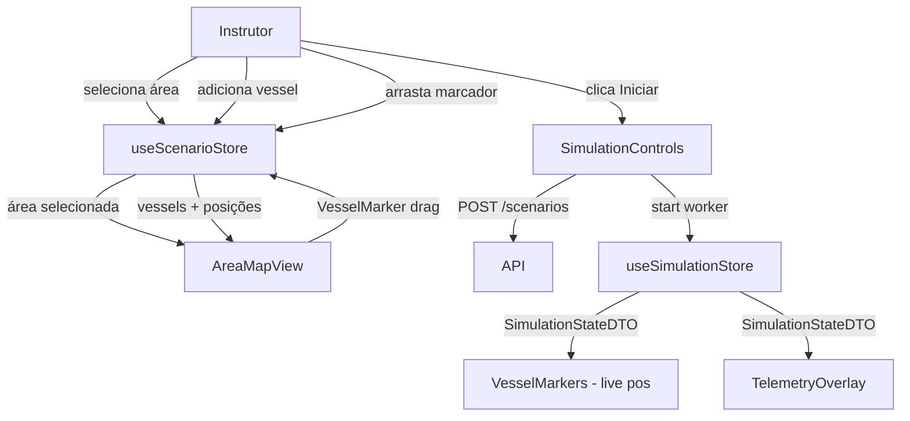

# Scenario Creator — Design

**Spec**: `docs/specs/features/scenario-creator/spec.md`  
**Status**: Draft  

---

## Visão Geral da Arquitetura

Layout de dois painéis: sidebar de configuração à esquerda + mapa de tela cheia como canvas principal. A simulação roda no Web Worker existente; o mapa reflete o estado em tempo real via `useSimulationStore`.

```
┌─────────────────────────────────────────────────────────────┐
│  ScenarioCreatorPage                                        │
│  ┌───────────────┐  ┌──────────────────────────────────────┐│
│  │  Sidebar       │  │  AreaMapView (Leaflet)               ││
│  │               │  │                                      ││
│  │ · ScenarioForm│  │  [polígono da área]                  ││
│  │ · VesselList  │  │                                      ││
│  │               │  │  ⚓ VesselMarker (draggável)         ││
│  │ ─────────────│  │  ⚓ VesselMarker (draggável)         ││
│  │  SimControls  │  │                                      ││
│  └───────────────┘  └──────────────────────────────────────┘│
└─────────────────────────────────────────────────────────────┘
```

### Fluxo de dados



---

## Análise de Reuso de Código

### Componentes/Stores Existentes

| O que | Onde | Como reusa |
|-------|------|-----------|
| `useSimulationStore` | `src/stores/simulationStore.ts` | Extender com `loadScenario(scenario)` — passa condições iniciais ao worker |
| `simulation.worker.ts` | `src/workers/` | Já existe; recebe `start`/`stop`; adicionar `loadScenario` message |
| `SimulationStateDTO`, `VesselStateDTO` | `@ymir/types` | Tipos já disponíveis para posição em tempo real |
| `AreaDTO`, `VesselDTO`, `VesselConfigDTO` | `@ymir/types` | Já definidos nas sessões anteriores |
| `ScenarioDTO`, `CreateScenarioDTO` | `@ymir/types` | Usado no `POST /scenarios` |

### Pontos de Integração com a API

| Endpoint | Usado por | Quando |
|----------|-----------|--------|
| `GET /areas` | `useAreas()` hook | Carregamento inicial da sidebar |
| `GET /areas/:id` | (via store) | Ao selecionar área — busca polígono |
| `GET /vessels` | `useVessels()` hook | Ao abrir seletor de vessel |
| `POST /scenarios` | `useSimulationStore.start()` | Ao clicar Iniciar |

---

## Dependências Novas

| Pacote | Versão | Motivo |
|--------|--------|--------|
| `leaflet` | `^1.9` | Motor de mapa — MIT, sem API key, suporte GeoJSON nativo |
| `react-leaflet` | `^4.2` | Bindings React para Leaflet; compatível com React 18 |
| `@types/leaflet` | `^1.9` | Tipos TypeScript |

**Decisão — Leaflet vs MapLibre GL:**  
Leaflet escolhido por simplicidade (renderização 2D, sem WebGL), MIT, zero configuração de API key, e suporte nativo a GeoJSON polígonos e marcadores draggáveis. MapLibre seria necessário apenas para tiles vetoriais 3D — fora de escopo.

**Tile provider**: OpenStreetMap (`https://{s}.tile.openstreetmap.org/{z}/{x}/{y}.png`) — gratuito, sem autenticação.

---

## Componentes

### `ScenarioCreatorPage`

- **Propósito**: Container raiz. Compõe Sidebar + AreaMapView. Substitui `App.tsx` como tela principal.
- **Localização**: `src/features/scenario-creator/ScenarioCreatorPage.tsx`
- **Interfaces**: nenhuma prop (root page)
- **Dependências**: `useScenarioStore`, `useSimulationStore`
- **Reusa**: nada diretamente; orquestra todos os filhos

---

### `Sidebar`

- **Propósito**: Painel lateral com formulário de cenário, lista de vessels, controles de simulação.
- **Localização**: `src/features/scenario-creator/components/Sidebar.tsx`
- **Interfaces**:
  - sem props — lê/escreve via stores
- **Dependências**: `useScenarioStore`, `useSimulationStore`, `ScenarioForm`, `VesselList`, `SimulationControls`
- **Reusa**: padrão de store do `useSimulationStore` existente

---

### `ScenarioForm`

- **Propósito**: Campo de nome do cenário + seletor de área.
- **Localização**: `src/features/scenario-creator/components/ScenarioForm.tsx`
- **Interfaces**:
  - sem props — lê/escreve `useScenarioStore`
- **Dependências**: `useAreas()` hook, `useScenarioStore`

---

### `VesselList`

- **Propósito**: Lista vessels adicionados ao cenário; botão "Adicionar vessel" que abre seletor.
- **Localização**: `src/features/scenario-creator/components/VesselList.tsx`
- **Interfaces**:
  - sem props
- **Dependências**: `useScenarioStore`, `useVessels()` hook
- **Comportamento**:
  - cada item mostra: nome do vessel, posição (x, y em metros), heading (graus), botão remover
  - heading editável inline (input number)

---

### `AreaMapView`

- **Propósito**: Canvas Leaflet mostrando mapa base + polígono da área + marcadores de vessels.
- **Localização**: `src/features/scenario-creator/components/AreaMapView.tsx`
- **Interfaces**:
  - sem props — lê `useScenarioStore` (área, vessels, posições) e `useSimulationStore` (estado em runtime)
- **Dependências**: `react-leaflet`, `useScenarioStore`, `useSimulationStore`, `VesselMarker`, `geo.ts`
- **Responsabilidades**:
  - Renderiza `TileLayer` (OSM)
  - Renderiza `Polygon` com coordenadas do `area.polygon`
  - Renderiza `VesselMarker` para cada vessel no cenário
  - Durante simulação ativa: atualiza posições dos marcadores via `SimulationStateDTO` (converte metros → lat/lng)
  - Ajusta bounds do mapa ao polígono da área na seleção

---

### `VesselMarker`

- **Propósito**: Marcador Leaflet draggável representando uma embarcação.
- **Localização**: `src/features/scenario-creator/components/VesselMarker.tsx`
- **Interfaces**:
  ```typescript
  interface VesselMarkerProps {
    vesselId: number
    name: string
    latLng: [number, number]      // lat, lng atual
    headingDeg: number
    draggable: boolean             // false durante simulação ativa
    onDragEnd: (latLng: [number, number]) => void
  }
  ```
- **Dependências**: `react-leaflet` (`Marker`, `Tooltip`, `Popup`)
- **Ícone**: ícone rotacionado pelo heading (CSS `transform: rotate(Xdeg)`)

---

### `SimulationControls`

- **Propósito**: Botões Iniciar/Parar + indicador de status + tempo de simulação.
- **Localização**: `src/features/scenario-creator/components/SimulationControls.tsx`
- **Interfaces**: sem props
- **Dependências**: `useSimulationStore`, `useScenarioStore`
- **Reusa**: lógica de `TelemetryPanel.tsx` (pode ser removido/substituído)

---

## Stores

### `useScenarioStore` (novo)

- **Localização**: `src/features/scenario-creator/store.ts`
- **Propósito**: Estado do cenário em construção — área, draft de vessels, posições iniciais.

```typescript
interface ScenarioDraftVessel {
  vesselId: number
  name: string
  x: number        // metros, relativo à origem da área
  y: number
  headingDeg: number  // 0–360
}

interface ScenarioStore {
  name: string
  areaId: number | null
  area: AreaDTO | null
  vessels: ScenarioDraftVessel[]
  
  setName: (name: string) => void
  setArea: (area: AreaDTO) => void
  addVessel: (vessel: Pick<ScenarioDraftVessel, 'vesselId' | 'name'>) => void
  removeVessel: (vesselId: number) => void
  updateVesselPosition: (vesselId: number, x: number, y: number) => void
  updateVesselHeading: (vesselId: number, headingDeg: number) => void
  reset: () => void
  toCreateScenarioDTO: () => CreateScenarioDTO   // serializa para POST
}
```

---

### `useSimulationStore` (extensão)

Adicionar `loadScenario(draft: ScenarioDraftVessel[])` que substitui o `addVessel(1)` hardcoded por um array de vessels com condições iniciais reais.

---

## Hooks

### `useAreas()`

- **Localização**: `src/features/scenario-creator/hooks/use-areas.ts`
- **Retorna**: `{ areas: AreaDTO[], loading: boolean, error: string | null }`
- **Implementação**: `fetch('/api/areas')` em `useEffect`

### `useVessels()`

- **Localização**: `src/features/scenario-creator/hooks/use-vessels.ts`  
- **Retorna**: `{ vessels: VesselDTO[], loading: boolean, error: string | null }`
- **Implementação**: `fetch('/api/vessels')` em `useEffect`

---

## Utilitários

### `geo.ts`

- **Localização**: `src/lib/geo.ts`
- **Propósito**: Conversão entre coordenadas geográficas (lat/lng) e métricas (x, y em metros) relativas à origem da área.

```typescript
/** Origem da área → converte lat/lng → metros */
function latlngToMeters(
  lat: number, lng: number,
  origin: { latitude: number; longitude: number }
): { x: number; y: number }

/** Metros → lat/lng para posicionamento no Leaflet */
function metersToLatLng(
  x: number, y: number,
  origin: { latitude: number; longitude: number }
): [number, number]  // [lat, lng]
```

**Fórmula** (projeção equiretangular — válida para áreas pequenas < ~100 km):
```
R = 6371000  // raio médio da Terra [m]
dy = lat - origin_lat   (graus)
dx = (lng - origin_lng) * cos(origin_lat * π/180)  (graus)
x = dx * R * π/180      [m] (Leste positivo)
y = dy * R * π/180      [m] (Norte positivo)
```

Erro máximo para Baía de Guanabara (~70km × 50km): < 0.3% — adequado para simulação de manobra portuária.

---

## Estrutura de Pastas (resultado final)

```
src/
├── features/
│   └── scenario-creator/
│       ├── ScenarioCreatorPage.tsx
│       ├── store.ts                    ← useScenarioStore
│       ├── components/
│       │   ├── Sidebar.tsx
│       │   ├── ScenarioForm.tsx
│       │   ├── VesselList.tsx
│       │   ├── AreaMapView.tsx
│       │   ├── VesselMarker.tsx
│       │   └── SimulationControls.tsx
│       └── hooks/
│           ├── use-areas.ts
│           └── use-vessels.ts
├── lib/
│   └── geo.ts
├── stores/
│   └── simulationStore.ts              ← existente, extender
├── workers/
│   └── simulation.worker.ts            ← existente, extender
└── App.tsx                             ← substituir por <ScenarioCreatorPage />
```

---

## Tratamento de Erros

| Cenário | Tratamento | O que o usuário vê |
|---------|------------|-------------------|
| `GET /areas` falha | retry automático (3x) + estado de erro | "Erro ao carregar áreas. Tentar novamente." |
| `GET /vessels` falha | idem | "Erro ao carregar embarcações." |
| `POST /scenarios` falha | não inicia worker; exibe erro | "Não foi possível salvar o cenário." |
| Worker crash | `useSimulationStore` status = `error` | banner de erro + botão reset |
| Vessel posicionado fora do polígono | ponto-em-polígono check em `updateVesselPosition` | marker volta para última posição válida + mensagem |

---

## Decisões Técnicas

| Decisão | Escolha | Motivo |
|---------|---------|--------|
| Mapa | Leaflet + OSM tiles | MIT, sem API key, GeoJSON nativo, suporte drag nativo |
| Projeção | Equiretangular local | Suficiente para áreas portuárias; sem dependência de proj4 |
| Estado do draft | Zustand `useScenarioStore` separado do `useSimulationStore` | Concerns distintos: configuração vs runtime |
| CSS do mapa | `height: 100vh` no container | Leaflet requer dimensão explícita para renderizar |
| Ícone do vessel | SVG inline rotacionado via CSS | Sem assets externos; heading refletido visualmente |
| `POST /scenarios` no Iniciar | Cria cenário no DB antes de iniciar worker | Garante rastreabilidade; worker recebe IDs reais |
